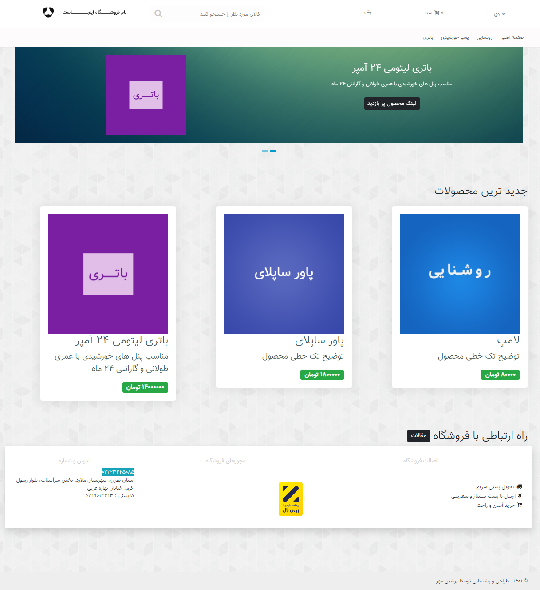
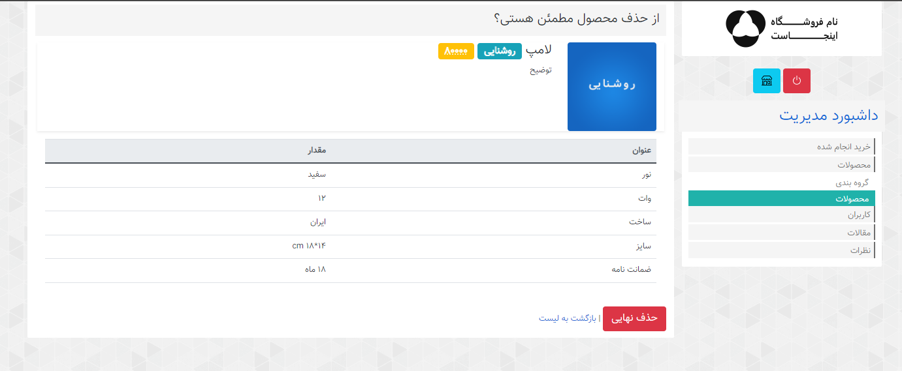

# مستندات مربوط به پروژه
برنامه فروشگاهی در دو سطح `Admin` و `User` تعریف شده.
قابلیت های عمومی این نرم افزار مشاهده محصولات و مقالات می باشد.
<br>
پروژه از نوع `asp-net core 7` می باشد.
پایگاه داده آن `SQL` می باشد.
<br>


<!-- TABLE OF CONTENTS -->
<details open="open">
  <summary>مطالب</summary>
  <ol>
    <li>
        <a href="#sevice">service</a>
    </li>
    <li>
      <a href="#setting">setting</a>   
    </li>
    <li>
      <a href="#about-me">about me</a>
    </li>
  </ol>
</details>


 <br/> *صفحه اصلی برنامه*

<br/>


## sevice
لیست وب سرویس های متصل به پروژه
```
https://portal.amootsms.com/webservice2.asmx?wsdl
https://ikc.shaparak.ir/TToken/Tokens.svc
https://ikc.shaparak.ir/TVerify/Verify.svc
```


## setting
* تنظیمات در فایل `SettingXML.xml` نگهداری می شود.
* ناحیه بندی
```c#
app.MapControllerRoute(
    name: "admin",
    pattern: "{area:exists}/{controller=AdminProfile}/{action=Index}/{id?}");

app.MapControllerRoute(
    name: "user",
    pattern: "{area:exists}/{controller=UserProfile}/{action=Index}/{id?}");
```
* رشته اتصال به `sql server`
```c#
builder.Services.AddDbContext<DatabaseContext>
    (options => options.UseSqlServer
    (builder.Configuration.GetConnectionString("DefualtConnection")));
```
* احراز هویت کاربر و نقش در سیستم و دیتابیس
```c#
builder.Services.AddIdentity<AppUser, AppRole>()
    .AddEntityFrameworkStores<DatabaseContext>()
    .AddDefaultTokenProviders();
```
* اکانت ادمین
```c#
 UserName: *********
 Password: *********
```

* اکانت کاربر
```c#
 UserName: **********
 Password: **********
```

* Cache Cookeis name
```c#
product: _product
```

* نکته:
این ورژن از نرم افزار دیگر نیازی به طراحی `seed data` و اجرای `Database.Migrate` نداشته و به صورت تنظیماتی مقدار دهی اولیه می شود، بدین منظور از لایه ی دسترسی به دیتابیس  `config` به طور مرتب نوشته شده اند.


 <br/> *پنل مدیریتی*


## about me
کارشناس توسعه نرم افزار Back-end
[لینکدین](https://www.linkedin.com/in/mohamad-ganji-nezhad/)


<!-- Feb 2023 Muhammad Ganji Nezhad-->
